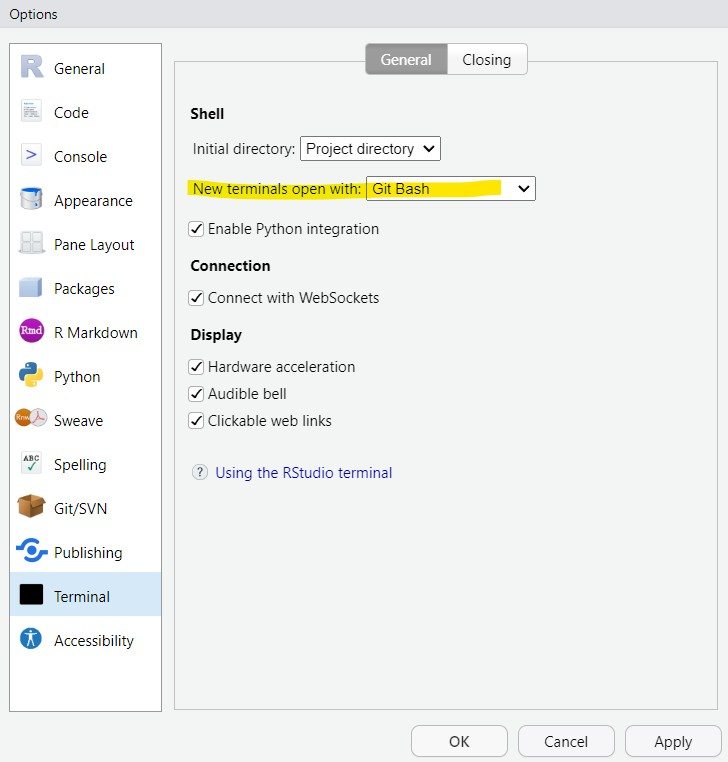

# Conectar Github con RStudio

## Configurar RStudio para usar Git Bash como terminal

1.  Abre **RStudio**.

2.  Dirígete a **Tools** (Herramientas) en la barra superior y selecciona **Global Options** (Opciones globales).

3.  En el menú de opciones globales, selecciona la pestaña **Terminal**.

4.  En el campo **New terminal open with**, selecciona **Git Bash**.

    

5.  Haz clic en **Apply** y luego en **OK**.

## Abrir la terminal de Git Bash en RStudio

Ahora, para abrir la terminal de **Git Bash dentro de RStudio**, solo tienes que:

-   Ir al **Tools** , hacer clic en **Terminal** y en abrir **New terminal**.

-   Deberías ver que se abre una nueva sesión con **Git Bash** como la terminal predeterminada.

## Verificar la conexión

Vuelve a la terminal y ejecuta el siguiente comando para verificar que tu clave SSH está correctamente configurada con GitHub:

``` {.bash eval="false"}
ssh -T git@github.com
```

En caso de que se necesite, puedes especificar la llave que usaste:

``` {.bash eval="false"}
ssh -i ~/.ssh/id_ed25519 -T git@github.com
```

El comando `ssh -T git@github.com` simplemente verifica que tu clave privada se está usando correctamente y que tu clave pública ha sido registrada en GitHub.

Si es la primera vez que te conectas a GitHub con SSH, puede que veas un mensaje que te pregunte si deseas continuar conectándote. Escribe "yes".

Si todo está bien configurado, deberías ver un mensaje similar a este:

```         
Hi username! You've successfully authenticated, but GitHub does not provide shell access.
```

Esto confirmará que tu clave SSH se ha agregado correctamente a tu cuenta de GitHub y que la conexión es exitosa.

## Conexión con HTTPS

Primero debemos asegurarnos que tenemos instalados los paquetes adecuados:

``` r
install.packages(c("usethis", "gitcreds", "gh"))
```

Ahora debemos identificarnos con nuestras credenciales de GitHub.

``` r
usethis::use_git_config(user.name = "Usuario GitHub", user.email = "email de la cuenta de GitHub")
```

Para poder subir los cambios a GitHub, necesitamos autenticarnos, es decir, probar que somos los dueños de la cuenta de GitHub.

Con este método, se pueden clonar los repositorios usando el url que sale en HTTPS. Para este, necesitamos un **personal access token** (PATH).

Para obtener el PATH, vamos a correr lo siguiente en la consola de R:

``` r
usethis::create_github_token(
  scopes = c("repo", "user", "gist", "workflow"),
  description = "alguna descripcion",
  host = "https://github.com/"
)
```

Esta función nos abrirá un navegador para generar el PATH:

-   Dar una descripción al PATH: por ejemplo "Laptop personal/Computadora laboratorio".
-   Cambiar la fecha de vencimiento: la fecha puede ser por cierta cantidad de días o sin fecha de vencimiento.
-   Dejar las demás opciones default y seleccionar `Generar token`. Este token deben de **guardarlo** en algún lugar ya que no es posible verlo de nuevo una vez que cierren la página.

Si olvidan su PATH es posible generar otro.

Para guardar el PATH, ejecuten el siguiente código en la consola de RStudio:

``` r
gitcreds::gitcreds_set(url="http://github.user")
```

Cuando se habrá la ventana les pedirá pegar su PATH en la consola y presionar enter. De está forma las credenciales ya quedarán guardadas en su computadora.

Para confirmar que su PATH si se guardo correctamente, correremos el siguiente código:

``` r
gh::gh_whoami(.token = "ghnaojdnvoadenvas_dcasc86<", .api_url = "https://github.com")


usethis::git_sitrep()
```

Lo que deberán ver son sus datos de su cuenta de GitHub.
