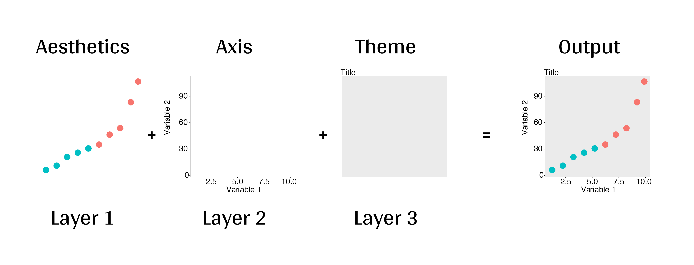
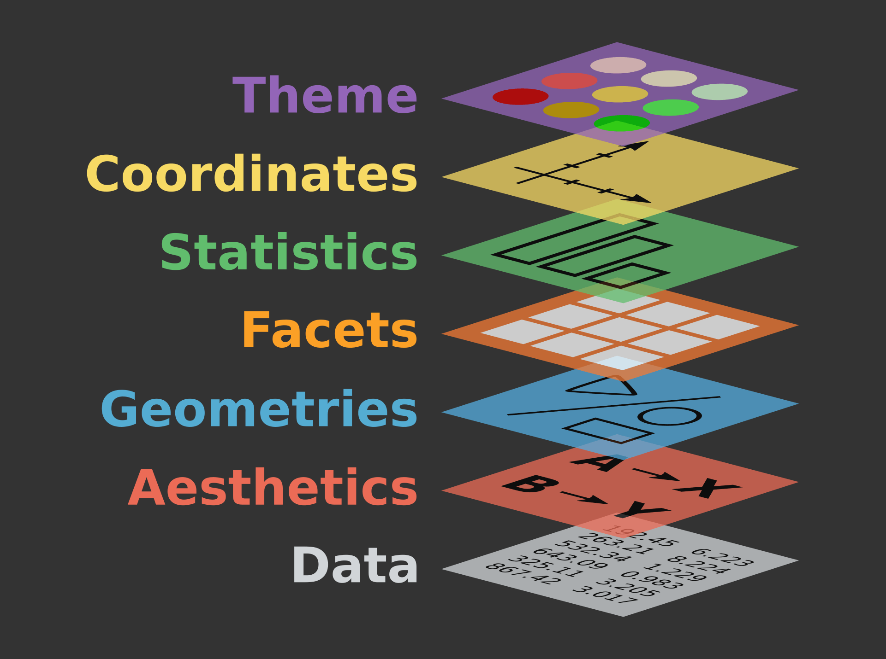

# La Gramática de los Gráficos (GG)

Empecemos por lo básico. El paquete `ggplot2` se basa en la Gramática de los Gráficos (GG), que es un marco para la visualización de datos que disecciona cada componente de un gráfico en **componentes individuales**, creando **capas distintas**. Utilizando el sistema GG, podemos construir gráficos paso a paso para obtener resultados flexibles y personalizables.

::: text-center
[{width="120%"}](https://r.qcbs.ca/workshop03/book-en/grammar-of-graphics-gg-basics.html)
:::

Las capas GG tienen nombres específicos que veremos en las siguientes secciones.

::: text-center
[{width="120%"}](https://r.qcbs.ca/workshop03/book-en/grammar-of-graphics-gg-basics.html)
:::

Para hacer un ggplot, las capas de datos y mapas son requisitos básicos, mientras que las otras capas son para personalización adicional. Las capas que no son necesarias siguen siendo importantes, pero se pueden generar graficos sin ellas.

## Desglose de las capas comunes

-   **Datos:**
    -   `sus datos`, en formato `tidy` o `dataframe`, proporcionarán los ingredientes para su trazado
    -   utilice las técnicas `dplyr` para preparar los datos para un formato de trazado óptimo
    -   por lo general, esto significa que debe tener una fila por cada observación que desea trazar
-   **Estética (Aesthetics / aes)**, para hacer visibles los datos
    -   `x`, `y`: variable a lo largo de los ejes x e y.
    -   `colour`: color de las variables según los datos.
    -   `fill`: color interior de la zona o relleno.
    -   `group`: a qué grupo pertenece una geom.
    -   `shape`: la figura utilizada para trazar un punto.
    -   `linetype`: tipo de línea utilizada (sólida, discontinua, etc.).
    -   `size`: escala de tamaño para una dimensión extra
    -   `alpha`: transparencia del objeto geométrico
-   **Objetos geométricos** (geoms - determina el tipo de trazado)
    -   `geom_point()`: gráfico de dispersión
    -   `geom_line()`: líneas que conectan puntos aumentando el valor de x
    -   `geom_path()`: líneas que conectan puntos en secuencia de aparición
    -   `geom_boxplot()`: gráfico de caja y bigotes para variables categóricas
    -   `geom_bar()`: gráficos de barras para el eje x categórico
    -   `geom_histogram()`: histograma para eje x continuo
    -   `geom_violin()`: núcleo de distribución de la dispersión de datos
    -   `geom_smooth()`: línea de función basada en datos
-   **Facetas:**
    -   `facet_wrap()` o `facet_grid()` para múltiplos pequeños
-   **Estadísticas:**
    -   similar a geoms, pero computada
    -   muestran medias, recuentos y otros resúmenes estadísticos de los datos
-   **Coordenadas** - ajuste de datos en una página
    -   `coord_cartesian` para establecer límites
    -   `coord_polar` para gráficos circulares
    -   `coord_map` para diferentes proyecciones cartográficas
-   **Temas:**
    -   parámetros visuales generales
    -   fuentes, colores, formas, contornos

## Colocando las capas juntas

Los pasos básicos para contruir el plot son los siguientes:

::: callout-note
1) Crear el objeto de plot:

- `plot_object <- ggplot()`

2) Agregar la capa geométrica

- `plot_object <- plot_object + geom_*()`

3) Agregar las capas de apariencia:

- `plot_object <- plot_object + geom_*() + theme()`

4) Repetir pasos 2 y 3 hasta estar satisfechos, luego imprimir:

- `plot_object`
:::

## Cheatsheet

{width="1000" height="1000"}

## Referencias

-   Más información en en el [Workshop 3: Introduction to data visualisation with ggplot2](https://r.qcbs.ca/workshop03/book-en/)

-   Haydee tutorial: [Seminario de Estadística: Análisis de Datos con R](https://haydeeperuyero.github.io/Seminario_Estadistica/visualizaci%C3%B3n-de-datos.html#ggplot2)

-   Tutorial R-Ladies Morelia [Reprohack 2024](https://r-ladies-morelia.github.io/Reprohack2024/Grupo2/docs/tema4.html)
